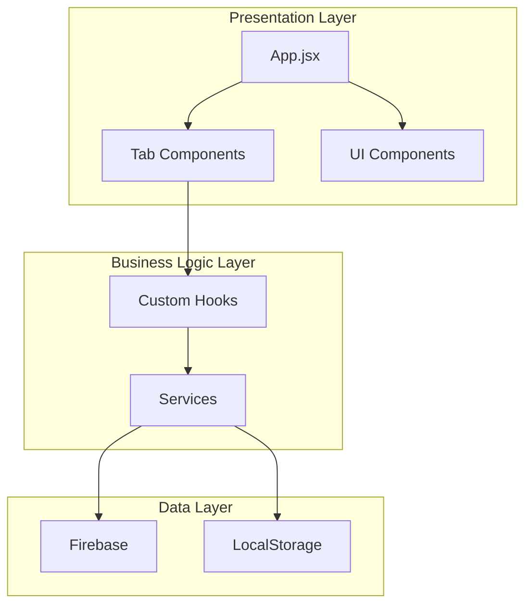

# Design Document: Project Refactor

## Overview

本设计文档描述了 145 联赛管理应用的全面重构方案。重构目标是提升代码可维护性、性能和开发体验，同时保持现有功能不变。

## Architecture

### 当前架构问题

```
src/
├── App.jsx              # 500+ 行，状态和逻辑过于集中
├── lib/
│   ├── firebase.js      # Firebase 配置和导出混合
│   └── utils.js         # 工具函数和常量混合
└── components/
    ├── tabs/            # Tab 组件，接收大量 props
    └── ...              # 其他组件
```

### 目标架构



### 新目录结构

```
src/
├── App.jsx                    # 精简后的主组件 (~150 行)
├── main.jsx
├── index.css
├── constants/
│   └── index.js               # 所有常量配置
├── types/
│   └── index.js               # JSDoc 类型定义
├── hooks/
│   ├── useStatsCalculator.js  # 统计数据计算
│   ├── useLeagueStats.js      # 联盟极值计算
│   ├── useFirebaseData.js     # Firebase 数据订阅
│   └── useTheme.js            # 主题管理
├── services/
│   └── firebase.service.js    # Firebase CRUD 操作
├── components/
│   ├── common/                # 通用组件
│   │   ├── ErrorBoundary.jsx
│   │   ├── Avatar.jsx
│   │   ├── Icon.jsx
│   │   └── Clock.jsx
│   ├── modals/                # 弹窗组件
│   │   ├── PlayerProfileModal.jsx
│   │   ├── SecurityModal.jsx
│   │   └── SettlementModal.jsx
│   ├── tabs/                  # Tab 页组件
│   └── layout/                # 布局组件
│       ├── Header.jsx
│       └── BottomNav.jsx
├── charts/                    # 图表组件
└── lib/
    └── utils.js               # 纯工具函数
```

## Components and Interfaces

### 1. Custom Hooks

#### useStatsCalculator

```javascript
/**
 * 计算玩家统计数据
 * @param {Match[]} matchHistory - 比赛历史
 * @param {string} selectedSeason - 选中的赛季
 * @param {Object} leagueStats - 联盟极值
 * @param {Object} playerProfiles - 玩家档案
 * @param {SortConfig} sortConfig - 排序配置
 * @returns {StatsData} 统计数据
 */
function useStatsCalculator(matchHistory, selectedSeason, leagueStats, playerProfiles, sortConfig) {
  return useMemo(() => {
    // 计算逻辑从 App.jsx 提取
  }, [matchHistory, selectedSeason, leagueStats, playerProfiles, sortConfig]);
}
```

#### useLeagueStats

```javascript
/**
 * 计算联盟极值统计
 * @param {Match[]} matchHistory - 比赛历史
 * @returns {LeagueStats} 联盟极值
 */
function useLeagueStats(matchHistory) {
  return useMemo(() => {
    // 计算 maxAvgScore, maxGoldContent, maxAvgChips, minAvgChips, maxAvgBeatRate
  }, [matchHistory]);
}
```

#### useFirebaseData

```javascript
/**
 * 订阅 Firebase 数据
 * @returns {{ matchHistory, playerProfiles, user, isAdmin, loading }}
 */
function useFirebaseData() {
  // 封装 onSnapshot 订阅逻辑
}
```

### 2. Firebase Service

```javascript
// src/services/firebase.service.js

/**
 * 保存比赛记录
 * @param {Match} matchData - 比赛数据
 * @param {string} [matchId] - 编辑时的比赛ID
 * @returns {Promise<string>} 比赛ID
 */
export async function saveMatch(matchData, matchId = null) {}

/**
 * 删除比赛记录
 * @param {string} matchId - 比赛ID
 * @returns {Promise<void>}
 */
export async function deleteMatch(matchId) {}

/**
 * 更新玩家档案
 * @param {string} playerName - 玩家名
 * @param {Partial<PlayerProfile>} data - 档案数据
 * @returns {Promise<void>}
 */
export async function updatePlayerProfile(playerName, data) {}

/**
 * 批量更名玩家
 * @param {string} oldName - 原名
 * @param {string} newName - 新名
 * @param {Match[]} matchHistory - 比赛历史
 * @returns {Promise<number>} 更新的比赛数量
 */
export async function renamePlayer(oldName, newName, matchHistory) {}
```

### 3. ErrorBoundary Component

```javascript
// src/components/common/ErrorBoundary.jsx

class ErrorBoundary extends React.Component {
  state = { hasError: false, error: null };
  
  static getDerivedStateFromError(error) {
    return { hasError: true, error };
  }
  
  componentDidCatch(error, errorInfo) {
    console.error('React Error:', error, errorInfo);
  }
  
  render() {
    if (this.state.hasError) {
      return <ErrorFallback error={this.state.error} onRetry={() => this.setState({ hasError: false })} />;
    }
    return this.props.children;
  }
}
```

## Data Models

### Type Definitions (JSDoc)

```javascript
// src/types/index.js

/**
 * @typedef {Object} Match
 * @property {string} id - 比赛ID
 * @property {string} date - 比赛日期 (YYYY-MM-DD)
 * @property {number} totalPlayers - 参赛人数
 * @property {PlayerResult[]} results - 比赛结果
 * @property {Transaction[]} [transactions] - 交易记录
 * @property {Object} [finalStacks] - 最终筹码
 * @property {string[]} [roster] - 参赛名单
 * @property {string} [votedMvp] - MVP
 * @property {string} [luckyPlayer] - 运气王
 */

/**
 * @typedef {Object} PlayerResult
 * @property {string} name - 玩家名
 * @property {number} rank - 排名
 * @property {number} score - 积分
 * @property {number} chips - 筹码盈亏
 */

/**
 * @typedef {Object} Transaction
 * @property {number} id - 交易ID
 * @property {string} buyer - 买家
 * @property {string} seller - 卖家
 * @property {number} amount - 金额
 * @property {string} time - 时间
 */

/**
 * @typedef {Object} PlayerStats
 * @property {string} name - 玩家名
 * @property {number} gamesPlayed - 参赛场次
 * @property {number} totalScore - 总积分
 * @property {number} totalChips - 总筹码
 * @property {number} wins - 胜场
 * @property {number} powerScore - 战力值
 * @property {number} avgScoreNum - 场均分(数值)
 * @property {string} avgScore - 场均分(字符串)
 * @property {number} avgChips - 场均筹码
 * @property {string} goldContent - 含金量
 * @property {number} votedMvpCount - MVP次数
 * @property {number} luckyCount - 运气王次数
 * @property {number[]} recentTrend - 近期趋势
 */

/**
 * @typedef {Object} LeagueStats
 * @property {number} maxAvgScore - 最高场均分
 * @property {number} maxGoldContent - 最高含金量
 * @property {number} maxAvgChips - 最高场均筹码
 * @property {number} minAvgChips - 最低场均筹码
 * @property {number} maxAvgBeatRate - 最高击败率
 */

/**
 * @typedef {Object} SortConfig
 * @property {string} key - 排序字段
 * @property {'asc'|'desc'} direction - 排序方向
 */
```

## Correctness Properties

*A property is a characteristic or behavior that should hold true across all valid executions of a system—essentially, a formal statement about what the system should do. Properties serve as the bridge between human-readable specifications and machine-verifiable correctness guarantees.*

### Property 1: Settlement Calculation Round-Trip

*For any* set of player results where total chips sum to zero, calculating settlements and then applying those settlements should result in all players having zero balance.

**Validates: Requirements 4.2**

### Property 2: Stats Calculation Invariants

*For any* match history and season filter, the calculated `leaderboardData` should satisfy:
- Total games played across all players equals sum of match participations
- Each player's `totalScore` equals sum of their individual match scores
- Each player's `wins` count equals number of rank-1 finishes

**Validates: Requirements 4.3**

### Property 3: Form Validation Completeness

*For any* form input that is empty, contains only whitespace, or violates business rules (e.g., negative amounts, duplicate players), the validation should reject it and prevent submission.

**Validates: Requirements 6.4**

### Property 4: Error Boundary Recovery

*For any* React component error within the ErrorBoundary, the boundary should catch it, display a fallback UI, and allow retry without crashing the entire app.

**Validates: Requirements 6.2, 6.5**

### Property 5: Accessibility Compliance

*For any* interactive element (button, link, input), it should have either visible text content, an aria-label, or an aria-labelledby reference.

**Validates: Requirements 7.1, 7.4**

### Property 6: Memo Optimization Effectiveness

*For any* Tab component wrapped with React.memo, when parent re-renders with identical props, the Tab component should not re-render.

**Validates: Requirements 3.1, 3.2**

## Error Handling

### Error Categories

| Category | Example | Handling Strategy |
|----------|---------|-------------------|
| Network | Firebase timeout | Show retry button, cache last known state |
| Validation | Invalid form input | Inline error messages, prevent submission |
| Runtime | Null reference | ErrorBoundary catches, show fallback UI |
| Auth | Session expired | Redirect to login, preserve draft data |

### Error Message Mapping

```javascript
const ERROR_MESSAGES = {
  'permission-denied': '权限不足，请联系管理员',
  'unavailable': '服务暂时不可用，请稍后重试',
  'network-request-failed': '网络连接失败，请检查网络',
  'invalid-argument': '数据格式错误，请检查输入',
  'default': '操作失败，请重试'
};
```

## Testing Strategy

### Dual Testing Approach

本项目采用单元测试和属性测试相结合的策略：

- **单元测试**: 验证具体示例和边界情况
- **属性测试**: 验证通用属性在所有输入上成立

### Test Configuration

- **框架**: Vitest + React Testing Library
- **属性测试库**: fast-check
- **覆盖率目标**: 工具函数 60%+

### Test Structure

```
src/
├── __tests__/
│   ├── hooks/
│   │   ├── useStatsCalculator.test.js
│   │   └── useStatsCalculator.property.test.js
│   ├── services/
│   │   └── firebase.service.test.js
│   ├── utils/
│   │   ├── utils.test.js
│   │   └── utils.property.test.js
│   └── components/
│       ├── Avatar.test.jsx
│       └── ErrorBoundary.test.jsx
```

### Property Test Example

```javascript
// Feature: project-refactor, Property 1: Settlement Calculation Round-Trip
import { fc } from 'fast-check';
import { calculateSettlements } from '../lib/utils';

describe('calculateSettlements', () => {
  it('should produce settlements that balance to zero', () => {
    fc.assert(
      fc.property(
        fc.array(
          fc.record({
            name: fc.string({ minLength: 1 }),
            chips: fc.integer({ min: -10000, max: 10000 })
          }),
          { minLength: 2, maxLength: 10 }
        ),
        (results) => {
          // Normalize to sum to zero
          const total = results.reduce((sum, r) => sum + r.chips, 0);
          if (results.length > 0) {
            results[0].chips -= total;
          }
          
          const settlements = calculateSettlements(results);
          
          // Verify all settlements are valid
          settlements.forEach(s => {
            expect(s.amount).toBeGreaterThan(0);
            expect(s.from).not.toBe(s.to);
          });
        }
      ),
      { numRuns: 100 }
    );
  });
});
```
