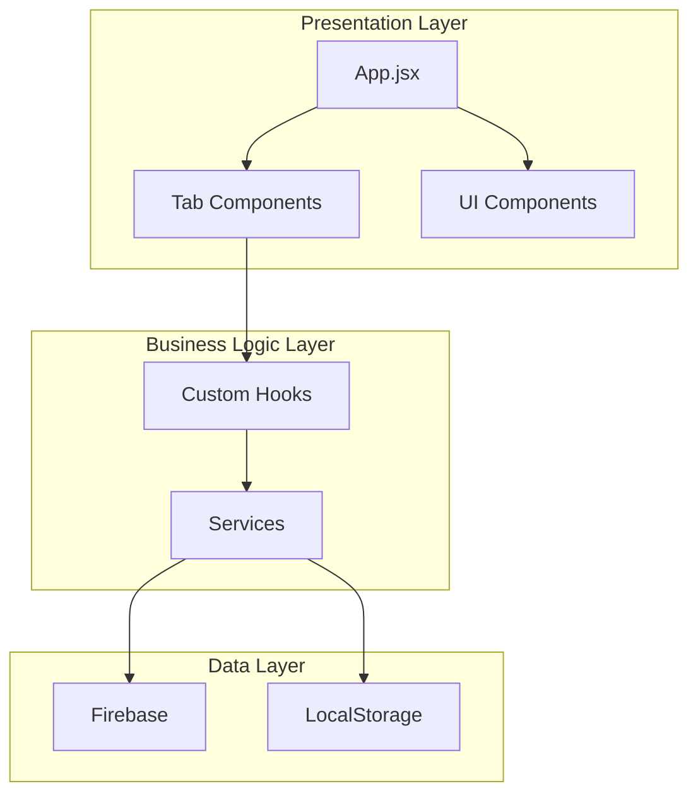

# 145 联赛管理应用

一个用于管理扑克联赛的现代化 Web 应用，支持比赛记录、玩家统计、排行榜和数据可视化。

## 功能特性

- 📊 **Dashboard** - 实时查看联赛概览和关键统计数据
- 🏆 **Leaderboard** - 玩家排行榜，支持多维度排序
- 📝 **Match History** - 完整的比赛历史记录和详情查看
- ➕ **New Game** - 快速录入新比赛结果
- ⚙️ **Settings** - 个性化设置和管理功能
- 🌙 **Dark Mode** - 支持深色/浅色主题切换
- 📱 **响应式设计** - 完美适配桌面和移动设备
- 🖥️ **Electron 支持** - 可作为桌面应用运行

## 技术栈

- **前端框架**: React 19 + Vite 7
- **样式**: Tailwind CSS
- **数据库**: Firebase Firestore
- **认证**: Firebase Authentication
- **图表**: Chart.js
- **图标**: Lucide React
- **测试**: Vitest + React Testing Library + fast-check
- **桌面应用**: Electron

## 快速开始

### 环境要求

- Node.js 18+
- npm 或 yarn

### 安装

```bash
# 克隆仓库
git clone <repository-url>
cd league-app

# 安装依赖
npm install
```

### 配置 Firebase

1. 在 [Firebase Console](https://console.firebase.google.com/) 创建项目
2. 启用 Firestore 和 Authentication
3. 复制 Firebase 配置到 `src/lib/firebase.js`

### 运行

```bash
# 开发模式 (Web)
npm run web

# 开发模式 (Electron)
npm run dev

# 构建生产版本
npm run build

# 预览生产版本
npm run preview
```

### 测试

```bash
# 运行测试
npm test

# 监听模式
npm run test:watch

# 覆盖率报告
npm run test:coverage
```


## 项目架构



### 目录结构

```
src/
├── App.jsx                    # 主应用组件
├── main.jsx                   # 应用入口
├── index.css                  # 全局样式
├── constants/
│   └── index.js               # 常量配置
├── types/
│   └── index.js               # JSDoc 类型定义
├── hooks/
│   ├── useStatsCalculator.js  # 统计数据计算
│   ├── useLeagueStats.js      # 联盟极值计算
│   ├── useFirebaseData.js     # Firebase 数据订阅
│   └── useTheme.js            # 主题管理
├── services/
│   └── firebase.service.js    # Firebase CRUD 操作
├── components/
│   ├── common/                # 通用组件
│   │   ├── ErrorBoundary.jsx
│   │   ├── Avatar.jsx
│   │   ├── Icon.jsx
│   │   └── Clock.jsx
│   ├── modals/                # 弹窗组件
│   │   ├── PlayerProfileModal.jsx
│   │   ├── SecurityModal.jsx
│   │   ├── SettlementModal.jsx
│   │   └── HeadToHead.jsx
│   ├── tabs/                  # Tab 页组件
│   │   ├── Dashboard.jsx
│   │   ├── Leaderboard.jsx
│   │   ├── MatchHistory.jsx
│   │   ├── NewGameForm.jsx
│   │   └── Settings.jsx
│   └── layout/                # 布局组件
│       ├── Header.jsx
│       └── BottomNav.jsx
├── charts/                    # 图表组件
│   ├── CareerChart.jsx
│   ├── ProRadarChart.jsx
│   └── Sparkline.jsx
├── lib/
│   ├── firebase.js            # Firebase 配置
│   └── utils.js               # 工具函数
└── __tests__/                 # 测试文件
    ├── components/
    ├── hooks/
    └── utils/
```

## 核心模块说明

### Custom Hooks

| Hook | 功能 |
|------|------|
| `useStatsCalculator` | 计算玩家统计数据（场均分、胜率、战力值等） |
| `useLeagueStats` | 计算联盟极值（最高/最低场均分等） |
| `useFirebaseData` | 订阅 Firebase 实时数据 |
| `useTheme` | 管理主题切换和持久化 |

### Services

| Service | 功能 |
|---------|------|
| `firebase.service.js` | 封装所有 Firebase CRUD 操作 |

### Components

| 类别 | 组件 |
|------|------|
| Common | Avatar, Icon, Clock, ErrorBoundary |
| Modals | PlayerProfileModal, SecurityModal, SettlementModal, HeadToHead |
| Tabs | Dashboard, Leaderboard, MatchHistory, NewGameForm, Settings |
| Layout | Header, BottomNav |
| Charts | CareerChart, ProRadarChart, Sparkline |

## 贡献指南

### 开发流程

1. Fork 本仓库
2. 创建功能分支 (`git checkout -b feature/amazing-feature`)
3. 提交更改 (`git commit -m 'Add some amazing feature'`)
4. 推送到分支 (`git push origin feature/amazing-feature`)
5. 创建 Pull Request

### 代码规范

- 使用 ESLint 进行代码检查：`npm run lint`
- 组件使用 PascalCase 命名
- 函数和变量使用 camelCase 命名
- 常量使用 SCREAMING_SNAKE_CASE 命名
- 所有导出函数需添加 JSDoc 注释

### 提交规范

使用 [Conventional Commits](https://www.conventionalcommits.org/) 格式：

- `feat:` 新功能
- `fix:` Bug 修复
- `docs:` 文档更新
- `style:` 代码格式（不影响功能）
- `refactor:` 代码重构
- `test:` 测试相关
- `chore:` 构建/工具相关

### 测试要求

- 新功能需要添加对应的单元测试
- 核心逻辑需要添加属性测试
- 运行 `npm test` 确保所有测试通过

## 许可证

MIT License

## 联系方式

如有问题或建议，请提交 Issue 或 Pull Request。
